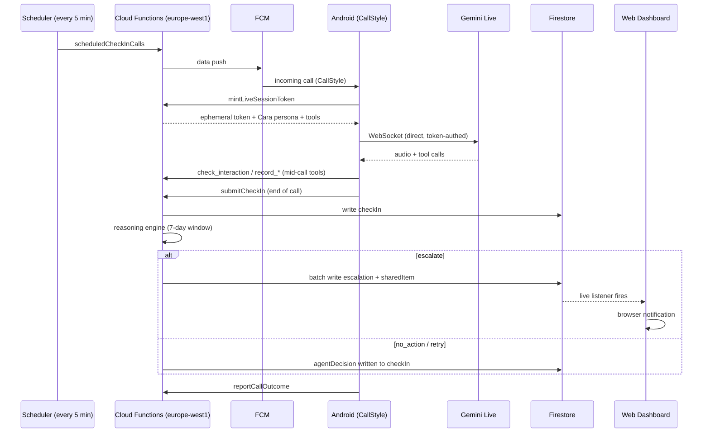

# CareLoop

An agentic AI companion built for the DDS Agentic AI Application Building Challenge
(13th ed., JetBrains/DDS). Solo project, Adam Ahmed, UAE.

This document is a technical and product account of what CareLoop is, how it works,
what has actually been verified, and what went wrong along the way and how it was
fixed. It draws directly from the project's own `CLAUDE.md`, the Cloud Functions
source, the Firestore rules, the Android call code, the web dashboard code, and the
git history. Nothing here is invented; where a number or fact could not be confirmed
against source, it is flagged as such rather than guessed.

---

## 1. Overview and the problem

CareLoop is not a reminder app. It is an agent, named Cara, that telephones an older
person once a day, on a real incoming-call screen, to check how they are doing with
their medication. It listens to *how* they answer, not just what they say. It checks
drug and food interactions live, mid-conversation, if something new comes up. It
reasons across a week of check-ins with a weighted concern score rather than a fixed
counter, and it decides, on its own, when a family member should be told, writing
down in plain language what it weighed and why. The family reads that reasoning on a
web dashboard. The elder reads the same thing, in their own app, because the product's
central ethical position is that nobody is watched by a system they cannot see back
into.

The reminder-app framing is deliberately rejected. A reminder fires on a schedule and
does not know whether anyone heard it. Cara is meant to notice the difference between
"yes" and "I think so," to know that a missed anticoagulant is not the same event as a
missed statin, and to explain an autonomous decision about someone's health in
sentences a worried adult child can actually read and trust.

The judging criteria for this challenge score explicitly for real autonomous
decision-making with visible reasoning, so every surface that shows the agent's
behaviour is built to make that reasoning legible rather than a black box. That
requirement shaped the reasoning engine (Section 5), the decision to template
escalation text instead of letting a model paraphrase it (D11), and the decision to
give the elder the same visibility as the family (D4).

---

## 2. How it works, end to end

### The call loop

1. **Scheduling.** A scheduled Cloud Function (`scheduledCheckInCalls`, every five
   minutes) compares each patient's stored local check-in time against the current
   time in their IANA timezone and fires a call when the window opens. A caretaker
   can also trigger one manually from the dashboard ("check on them now"), and a
   missed call can trigger an automatic retry. All three paths go through the same
   `triggerCall` callable and the same delivery code, deliberately: a manual call
   button that took a different path from the real scheduler would be a demo
   feature hiding bugs in the path that actually matters.

2. **Delivery.** `createAndDeliverCall` sends a data-only, high-priority FCM push to
   the patient's registered device. This is a genuine ring, not a notification the
   app polls for.

3. **The incoming-call screen.** On the phone, `CallNotifier` posts a `CallStyle`
   notification on an `IMPORTANCE_HIGH` channel. Before attaching a full-screen
   intent it checks `NotificationManager.canUseFullScreenIntent()` at runtime (see
   Section 9 and the constraint below); if granted, the screen takes over
   immediately, ringing, vibrating, and turning the screen on, exactly like a real
   phone call. If not granted, it still rings and vibrates as a high-priority
   heads-up notification rather than failing silently. The full-screen intent (the
   ringing UI) and the answer action are separate intents, wired to different
   moments, on purpose (see Section 9).

4. **The live conversation.** On answer, the app calls `mintLiveSessionToken`, which
   mints a single-use, short-lived (about 15 minutes) ephemeral token scoped to one
   Gemini Live model, along with Cara's full system instruction and tool
   declarations, built fresh from that patient's real data (medications, recent
   context, open threads). The app opens its own WebSocket directly to Gemini Live
   using that token; the API key never reaches the device and the audio never
   passes through CareLoop's own servers (D8).

5. **Mid-call tool use.** If the person mentions a new medicine, supplement, or
   food, Cara calls `check_interaction`, declared `behavior: NON_BLOCKING` so she
   keeps talking while the lookup runs and the result is folded in when it lands
   (D10). She also calls `record_medication_status`, `record_vital`,
   `record_health_condition`, `remember_for_next_time`, `close_open_thread`, and, in
   a genuine emergency, `report_urgent_concern` (Section 4).

6. **Submission.** At the end of the call the app calls `submitCheckIn` with the
   confirmed/missed medication lists, tone signals, any vitals recorded, and a
   transcript. The server writes the check-in, decrements dose supply for confirmed
   medications, and runs the reasoning engine (Section 5) against the last seven
   days of history, recomputed from source every time rather than kept as a running
   score.

7. **The decision.** The engine returns one of: say nothing, retry soon, retry
   later, or escalate. Every one of these is written back onto the check-in as an
   `agentDecision`, including the decision to do nothing and why, with the exact
   concern score and the threshold it was measured against.

8. **Escalation.** If the engine decides to tell the family, `writeEscalation`
   writes the escalation document and the elder's own "what I shared" entry in a
   single Firestore batch, never one without the other (D12). The web dashboard's
   live listener raises a browser notification the instant it arrives.

### The server log chain

The project's own stated rule is that the screen is never the evidence; the Cloud
Functions log is. A healthy, fully closed call produces exactly this sequence:

```
call.deliver.sent -> gemini.token.minted -> checkin.submitted -> call.outcome.reported
```

Anything missing from that chain is a broken loop no matter what the app appears to
show (see the "ring never told the server" bug in Section 11, which is exactly why
this rule exists). The recommended way to verify a real call is
`npx firebase-tools@latest functions:log -n 120 --project careloop-adam` - read the
server, not the screen.

---

## 3. Architecture

### Stack

| Layer | Choice | Why |
|---|---|---|
| Android | Kotlin + Jetpack Compose | `CallStyle` is a first-party API; the Flutter and React Native call-screen wrappers have documented Android 14+ breakage on exactly the answer-call transition. |
| Backend | Firebase Cloud Functions v2, Node.js 22, region `europe-west1` | Colocated with Firestore; 17 functions total (13 `onCall` callables + 4 scheduled). |
| Database | Firestore | Two-sided security model (Section 3, security model below). |
| Push | Firebase Cloud Messaging (FCM), data-only high-priority | The mechanism that makes the phone actually ring. |
| Auth | Firebase Anonymous Auth | Asking a person in their late 70s to invent and remember a password to receive a phone call was judged a worse failure mode than anonymous sign-in (see the "the app never authenticated" bug, Section 11). |
| Web | Next.js 16 + React 19 + Tailwind 4, deployed on Firebase App Hosting | One repo, one deploy path. |
| Charts | Recharts | Standard, restyles cleanly, with brand-adjacent (not brand) colours validated separately for contrast. |
| Conversational AI | Gemini Live (native-audio preview model) for the call itself; a separate Gemini text model for conversation summarisation | Live handles bidirectional voice with tool calling; the text model only writes the memory note (Section 7), never the escalation text (D11). |

### Data model (Firestore, abbreviated - see `functions/src/types.ts` for the full,
authoritative shape)

```
/patients/{patientId}                  elder profile, caretakerIds, sharingPreferences
  /medications/{id}                    name, dose, criticality, dosesRemaining, schedule
  /checkIns/{id}                       transcript, toneSignals, agentDecision, conversationSummary
  /vitals/{id}                         type, value, secondaryValue, source
  /escalations/{id}                    severity, headline, explanation, reasoning[], confidence,
                                        alternativesConsidered[], concernScore, elderResponse
  /sharedItems/{id}                    the elder's own transparency feed
  /callAttempts/{id}                   the retry/decline ledger
  /agentThreads/{id}                   things Cara decided to come back to
  /refills/{medicationId}              derived refill planning state
/deviceTokens/{uid}                    FCM tokens, never readable by any client
/users/{userId}                        caretaker display name / phone / relationship
/linkingCodes/{code}                   opaque one-time linking codes
```

`patientId` is always the elder's own auth uid. Timestamps cross the wire as
ISO-8601 strings (not Firestore's native `Timestamp`), because Kotlin and
TypeScript disagree about how to deserialise the native type.

### Security model (`firestore.rules`)

Two-sided, default-deny, with no globally readable path:

- An **elder** may read and write only their own data.
- A **caretaker** may **read** data only for elders who have explicitly linked them
  (`caretakerIds`, an array written only by server code after a one-time linking
  code is redeemed), and may write almost nothing - an acknowledgement flag, nothing
  else.
- `get` and `list` on `/patients/{patientId}` are deliberately different rules: a
  collection query cannot evaluate a rule that itself requires a `get()` on each
  candidate document, so the dashboard's `array-contains` query on `caretakerIds`
  has to be authorized directly from the returned document's own fields (see the
  "rules get vs list" bug, Section 11).
- Escalations, check-ins, agent threads, shared items, and call attempts are
  server-written; the only client mutations permitted are an elder confirming or
  disputing an escalation/shared item, or reporting a call outcome, each scoped with
  `onlyChanges([...])` so a write cannot smuggle through a change to a different
  field.
- Device tokens live in their own top-level collection, unreadable by any client,
  specifically so a caretaker's read access to a patient never incidentally exposes
  a device identifier.
- 31 rules test cases run on CI (`firebase emulators:exec`, since the emulator
  cannot run locally - see Section 11).

### Architecture diagram



---

## 4. Cara - persona and tools

Cara's identity is built in `functions/src/gemini/cara.ts`, assembled server-side
per session (never shipped in the APK) because it is genuinely per-patient data
(medications, open threads) and because a wording change should not need a store
release.

Persona rules, each traced to a stated rationale in the prompt itself:

- Warm but never babying - "Margaret," never "love" or "sweetie." Moderate
  anthropomorphism helps this audience; over-anthropomorphism backfires.
- States plainly that she is an AI if asked, and never deflects - transparency
  measurably improves trust for this cohort.
- Short sentences, real pauses, one question at a time - age-related hearing loss
  hits high frequencies first, so long unpunctuated sentences over a phone speaker
  are genuinely harder to follow.
- Explains mechanisms, not just prohibitions ("grapefruit blocks the enzyme that
  clears this drug," not just "avoid grapefruit") - advice people understand is
  advice they follow.
- Never gives medical advice, never recommends starting, stopping, or changing a
  dose - the line between an informational companion and clinical decision
  support is treated as both an ethical and a regulatory boundary.
- Announces an escalation on the call, in the moment, and asks whether it is okay
  to tell the family - the elder should never learn from a family member that
  Cara reported her.
- States an age only when one is actually known (`ageOf()`, from stored birth
  year, falling back to a legacy age field) - see the "0 years old" bug, Section
  11.
- Has an explicit instruction for the empty-medication-list case: do not ask about
  any tablet by name or by example, ask what they take instead - see the "heart
  pill" bug, Section 11.

### Tools (declared in `CARA_TOOLS`, handled by corresponding callables)

| Tool | Behaviour | Purpose |
|---|---|---|
| `check_interaction` | `NON_BLOCKING` | Checks a drug/food mentioned mid-call against everything the patient already takes, without going silent while it runs. |
| `record_medication_status` | blocking | Records taken/not-taken per medication, plus an explicit `uncertain` flag distinct from a plain no. |
| `record_vital` | blocking | Records a reading (blood sugar, blood pressure, heart rate, weight), carrying the unit (`mmol_l`/`mg_dl`) for blood sugar so it is never guessed or rounded. |
| `record_health_condition` | blocking | Records a long-term condition, only ever from something the person said themselves - never inferred from a medication. |
| `report_urgent_concern` | blocking, immediate | For chest pain, breathing difficulty, a fall, sudden weakness or confusion. Bypasses the scored reasoning engine entirely: writes an escalation and the elder's shared-item copy in the same batch, unscored, because the model has already been told to say "call emergency services" out loud before calling this. |
| `remember_for_next_time` | blocking | Opens an agent thread: a topic, why it matters, and a follow-up interval Cara herself chooses (clamped 1 to 30 days). |
| `close_open_thread` | blocking | Closes a thread by matching its topic text (not an opaque id, which the model cannot reliably echo back correctly mid-call) and records what happened. |

Voice: `Aoede`, a warm, mid-range voice chosen because age-related hearing loss
degrades high frequencies first. Language: `en-US` - not by preference but because
the native-audio model rejects `en-GB` outright (Section 11); Cara's script itself
stays British ("tablet," not "pill").

---

## 5. The reasoning engine, in depth

`functions/src/reasoning/engine.ts` is, by the project's own account, the file that
has to be genuinely defensible rather than merely functional: if it were a counter
with an if-statement, the product's central claim about weighted pattern reasoning
would be false, and visibly so to a judge reading the code.

### Factors and calibration

Every observation feeds a **concern score**, not a tally:

- **Criticality is a multiplier**, per medication: `critical = 1.0`, `high = 0.6`,
  `medium = 0.35`, `low = 0.15` (`CRITICALITY_WEIGHT`).
- **Repetition is super-linear**: the nth occurrence's contribution is
  `n^1.35 - (n-1)^1.35` (`REPETITION_EXPONENT = 1.35`) times the criticality
  weight times recency. Two misses is not twice one miss - two is treated as the
  point where "forgot" stops being the best explanation.
- **Uncertainty scores above a clean miss**: a check-in where the person sounded
  unsure (`toneSignals.confusion > 0.4`) adds a flat `UNCERTAINTY_WEIGHT = 0.7` on
  top of the repetition term, because "I think so" is a qualitatively different
  and more concerning signal than a clear no.
- **Recency decays by whole days**, linearly to zero at the 7-day window edge
  (`WINDOW_DAYS = 7`), not continuously - see the millisecond-threshold bug,
  Section 11.
- **Vitals** contribute `VITALS_ANOMALY_WEIGHT = 0.4` when the later half of a
  ≥3-reading window differs from the earlier half by more than 15%, i.e. a trend,
  not a single odd reading.
- **Unanswered calls** contribute `NO_ANSWER_WEIGHT = 0.25` per consecutive miss,
  and separately drive an adaptive retry ladder.

Escalation fires at `ESCALATION_THRESHOLD = 1.0`; `URGENT_THRESHOLD = 2.0`
distinguishes a routine "concern" escalation from an "urgent" one. Worked example
from the engine's own comments: one missed critical-medication dose scores exactly
`1.0` (the repetition term for occurrence 1 is `1^1.35 = 1.0`, times criticality
weight `1.0`, times a same-day recency factor of `1.0`) - which escalates
immediately, calibrated deliberately so a single missed anticoagulant is never
allowed to sit below the line.

Calibration, as printed by the evaluation harness itself (`npm run eval` in
`functions/`):

| Scenario | Concern score | Decision |
| --- | --- | --- |
| 1 missed statin (low criticality) | 0.15 | stays quiet |
| 3 consecutive missed statins | 0.55 | stays quiet |
| 5 consecutive missed statins | 0.87 | stays quiet |
| 1 missed anticoagulant (critical) | 1.00 | escalates |

### Adaptive retry / no-answer patience

`NO_ANSWER_PATIENCE` differs by the patient's *most critical* medication:
`critical = 2`, `high = 3`, `medium = 3`, `low = 4` consecutive unanswered calls
before escalating instead of retrying. Retry intervals: `critical = 10 min`,
`high = 30 min`, everything else `90 min`. Past four calls in a day
(`attemptsToday >= 4`), the engine escalates rather than continuing to call  - 
"more calls become harassment, not care," in the code's own words. Manual calls
requested by a person (from the phone or the dashboard) never count toward this
cap - a person asking to be called is never harassment (see Section 11).

Same-day follow-up calls, when a miss on a today's call did not cross the
escalation threshold but the medication genuinely matters: `120` minutes for
`critical`, `180` minutes for `high`, none for `medium`/`low` - nagging about a
vitamin twice in a day is exactly the behaviour the product exists not to produce.

### Visible reasoning (D11)

Every escalation carries at most **three** reasoning steps (`ReasoningStep`:
observation, evidence, and a citable `checkInId`), capped deliberately - research
on explaining decisions to non-technical readers says more reasons read as *less*
trustworthy, not more. Confidence is expressed as words (`"I'm quite sure"` /
`"I'm fairly confident"` / `"I'm not certain"`), never a percentage, because false
precision reads as evasive to lay readers. Every escalation also lists
`alternativesConsidered` - what the agent weighed and rejected (e.g. "waiting
another day," "treating it as ordinary forgetfulness") - as evidence of judgement
rather than of a threshold being crossed.

Crucially: **escalation and hold-back explanations are templated, not
model-generated** (D11). This text is the audit trail for an autonomous decision
about someone's health; a model paraphrasing it could produce something fluent
that misstates what was actually weighed, which is precisely the failure mode the
product claims not to have. (A model *is* used elsewhere - for the conversational
memory summary, Section 7 - because that is description, not justification.)

Restraint is recorded, not silent: a decision to say nothing is written to
`agentDecision` on the check-in exactly like a decision to escalate, with its own
`headline`, `explanation`, and the concern score against the threshold - see the
"an agent's restraint is invisible is indistinguishable from one that was not
listening" bug, Section 11.

### The evaluation harness

`functions/src/eval/run.ts` runs the engine against constructed scenarios and
asserts 19 checks: 15 reasoning invariants (`R1` to `R15`) and 4 interaction
checks (`I1` to `I4`). The count grew from 16 to 19 as new bugs were found and each
fix gained an invariant that fails the build if the bug returns. All 19 pass.
Representative invariants:

- **R1** - a week of confirmed doses never escalates.
- **R2** - a single missed critical dose reaches the family.
- **R3** - a single missed low-criticality dose does not.
- **R4** - a full week of missed doses escalates even at the lowest criticality.
- **R5** - uncertainty is never treated as less concerning than a clean miss.
- **R6** - every escalation cites at least one specific check-in.
- **R7** - escalations always carry a headline and an explanation.
- **R8** - a more critical medication is chased sooner than a less critical one.
- **R9** - past the daily attempt ceiling, it escalates instead of calling again.
- **R10** - never escalates without naming an alternative it considered.
- **R11** - the same evidence produces the same decision and score regardless of
  the exact moment it is reasoned about (added after the millisecond-threshold bug).
- **R12** - two misses recorded on the same calendar day are one day of evidence,
  not two (added after the "missed her warfarin today and today" bug).
- **R13** - holding back on a missed dose always states why and what happens next.
- **R14** - a same-day callback is reserved for medications where missing a dose
  actually matters.
- **R15** - a clean call produces no decision text at all.

---

## 6. Interaction checking (D9)

There is no longer a single free drug-drug interaction API to call: the NLM
retired RxNav's `/interaction/` endpoints in January 2024, and DrugBank's free
checker is scheduled to follow in March 2026. `functions/src/interactions/` layers
three sources instead, strongest first:

1. **A curated ruleset** (`drugs.ts`) of high-severity interactions that matter for
   this population, matched offline and deterministically - warfarin plus
   ibuprofen/NSAIDs, warfarin plus certain enzyme-inhibiting antibiotics/antifungals,
   ACE inhibitors/ARBs plus potassium-sparing diuretics, and others. This layer
   must never depend on network availability, because it covers combinations that
   are both genuinely dangerous and genuinely common in elderly polypharmacy.
2. **openFDA label prose**, searched for the patient's actual other medications  - 
   free text, not structured data, so this catches real interactions the curated
   list misses at the cost of occasionally matching loosely.
3. **RxNorm approximate name matching**, because a person says a drug name
   imprecisely aloud ("the water tablet, frusemide").

Results are cached in Firestore for a week; interaction data is effectively
static, both upstream APIs are rate-limited, and - critically - a cache hit during
a live call is the difference between Cara answering naturally and Cara pausing.
All network calls during a call have a 4-second timeout so a slow response
degrades to "what we know offline" rather than a silent gap. `summariseForSpeech`
returns only the single most serious finding, because reading a list of five
interactions aloud to an 84-year-old on a phone call is not useful - nothing is
retained from a list.

Food-drug interactions are also curated in `foodRules.ts`, including
explicitly correcting common misconceptions rather than repeating them - the
popular advice to avoid leafy greens on warfarin is wrong and potentially harmful;
what matters is *consistency*, not avoidance, and Cara is instructed to correct
this gently rather than parrot it.

---

## 7. Memory

Three distinct layers of memory, deliberately kept separate:

- **Agent threads** (`agentThreads`) - Cara's own record of something she decided,
  on her own initiative during a call, to come back to later: a topic, why it
  matters, and a follow-up interval she chooses herself (clamped 1 to 30 days).
  Explicitly not a free-form memory blob: a thread must name one thing and say why
  it matters, kept legible to both the elder and family. Cheaply deduplicated
  (case-insensitive topic match against open threads) because the model cannot be
  trusted to remember it already opened one. Rendered on *both* dashboards, phone
  and web, because - in the project's words - "a memory the person cannot see is
  surveillance." (The Android side of this was a gap fixed later; see Section 12.)
- **Conversation summaries** (`conversationSummary` on each check-in) - a separate
  Gemini text-model call, at most three short plain sentences, written to be
  something the patient would be comfortable reading about themselves. Skipped
  entirely for calls with fewer than two spoken lines from the elder, so a
  two-line call does not invite padding. Allowed to fail silently (returns `null`)
  - a missing summary costs Cara some continuity; a failed check-in write would
  cost the record itself, which is the more important thing to protect.
- **Dated recent context** - six most recent check-in summaries, converted into
  relative day language ("Earlier today," "Yesterday," a weekday name) in the
  patient's own timezone, so Cara can say "last time you said your knee was
  playing up" rather than reciting an undated list.

---

## 8. Dignity and privacy

- **Symmetric transparency (D4).** The elder sees everything the family sees.
  Escalations and the elder's own "what I shared" entry are written in one
  Firestore batch (D12) so an escalation can never exist without the elder being
  told about it in the same breath.
- **Confirm/dispute.** The elder can respond to any escalation or shared item  - 
  `confirmed`, `disputed`, plus an optional note - which the dashboard is required
  to render distinctly (a blank state under an escalation reads as agreement, not
  as "not yet seen"; see Section 11).
- **Sharing preferences with an urgent floor.** The elder can mute routine
  categories of sharing, but `alwaysShareUrgent` is a floor shown to them plainly,
  never hidden - even with everything else muted, a genuine emergency still
  reaches family, and hiding that fact would itself be the paternalism this
  feature exists to avoid.
- **Unlink is real.** `unlinkCaretaker` lets the elder remove any caretaker, and
  lets a caretaker remove only themselves (never another caretaker - that would
  let one family member cut another out, which the software has no business
  adjudicating). Consent that cannot be withdrawn is not consent; this did not
  exist for a period of the project and was flagged as a real hole once noticed.
  Either way the elder is told, via a `sharedItems` entry, because a silent access
  change is the same failure as a silent escalation.
- **Redacting logger by construction (D13).** `lib/logging.ts` rejects suspicious
  field names and over-long values before anything reaches Cloud Logging; no
  medication, vitals, transcript, name, or uid is ever logged. `logError`
  deliberately omits the error message and stack, because a Firestore or HTTP error
  routinely contains the document path or response body.
- **Example data must always say it is example data (D14, revised).** The phone
  falls back to an empty state, never to demo data - an elder's own record showing
  a stranger's medications would be wrong about the one thing it exists to be
  right about. The dashboard still shows an example household (a blank dashboard on
  first load looks broken), but only behind a full-width, always-visible banner
  saying plainly that it is not real. This was found switched off in production  - 
  see Section 11 for the exact bug.

---

## 9. Safety boundaries

- Cara never diagnoses and never recommends starting, stopping, or changing a
  dose; interaction findings are always routed to a GP or pharmacist, with a
  specific suggestion of what to ask.
- On a genuine emergency description (chest pain, breathing difficulty, a fall she
  cannot get up from, sudden weakness or confusion), Cara is instructed to stop
  the check-in, tell the person to call emergency services first, and only then
  call `report_urgent_concern` - which bypasses the scored reasoning engine
  entirely and escalates immediately and unconditionally.
- **The Android 14+ full-screen intent constraint.** `USE_FULL_SCREEN_INTENT` is
  not auto-granted to CareLoop on API 34+ (the auto-grant is reserved for apps
  whose core function is calling or alarms, a category a medication app does not
  automatically qualify for - an unresolved Play-policy question the project
  deliberately engineers for the pessimistic case). The call flow therefore always:
  (1) checks `canUseFullScreenIntent()` at runtime before attaching the intent;
  (2) falls back to a ringing, vibrating, screen-waking heads-up notification when
  it is not granted; (3) has an onboarding step that earns the permission in plain
  language, deep-linking to `ACTION_MANAGE_APP_USE_FULL_SCREEN_INTENT`. The
  full-screen (ringing) intent and the answer action are wired to different
  `PendingIntent`s, never the same one - conflating them makes the phone behave as
  though every call was answered the instant it arrived.
- Ephemeral Gemini Live tokens are single-use, expire in about 15 minutes, and must
  start a session within 2 minutes of being minted (D8) - the API key never leaves
  the server and is never shipped inside the APK, which is simply a zip file an
  attacker can open.
- Rate limits guard every write-side callable (e.g. 30 manual calls/hour, 5 urgent
  reports/hour, 8 memory-thread writes/hour, 5 linking-code generations/hour),
  loose enough not to refuse a call a worried family member is pressing for
  repeatedly, tight enough to stop a runaway or malicious client.

---

## 10. Decision log

| # | Decision | Rationale |
|---|---|---|
| D1 | Native Kotlin over Flutter/React Native | Both wrappers have documented Android 14+ breakage on precisely the answer-call transition; the SDK and emulator were already available locally to actually verify the signature feature. |
| D2 | One restrained WebGL hero on the marketing site, not 3D throughout | Adam's call. Heavy 3D risks reading as templated; one lazy-loaded volumetric ring with a static fallback for mobile/`prefers-reduced-motion` is more distinctive. |
| D3 | Cara has no avatar or face | Research found no measured benefit for this cohort and a real uncanny-valley/infantilisation risk; the closest shipped precedent (ElliQ) deliberately used abstract light and motion instead. |
| D4 | Elder-side control is first-class, not an afterthought | Adam's call. 49% of older adults are documented as uncomfortable with passive monitoring even when the safety benefit is clear, and that discomfort resolves with perceived control, not better privacy terms; no shipped product in the space was found to solve this. |
| D5 | Build for live-on-device | The demo is likely an emulator, possibly a real phone; device robustness is a superset of both. |
| D6 | Keep the brand palette, add explicit contrast rules | Blue-yellow discrimination is documented to degrade first with age, and the brand sits close to that axis; solved with darkened gold for text and luminance verification rather than dropping the palette. |
| D7 | One Next.js app, not a split Astro+Next stack | Two build pipelines is a worse story for a non-professional deployer than a few extra KB of JS on the marketing page. |
| D8 | Ephemeral Gemini Live tokens, minted server-side, no relay | Shipping the API key in the APK is a non-starter (an APK is a zip); relaying live audio through a function would double latency and turn one flaky connection into two. |
| D9 | Layered interaction checking, not a single lookup API | The free pairwise DDI APIs are retired or retiring; curated rules (deterministic, offline) plus openFDA label search plus RxNorm name resolution together cover what one dead endpoint used to. |
| D10 | `check_interaction` is `NON_BLOCKING` | Default blocking tool behaviour makes the model go silent mid-sentence while the lookup runs, which on a phone call reads as the line dropping. |
| D11 | Escalation (and hold-back) explanations are templated, not model-generated | This text is the audit trail for an autonomous health decision; a fluent model paraphrase could misstate what was actually weighed, which is the exact failure the product claims not to produce. |
| D12 | Escalation and the elder's own notice are one batch write | If an escalation could exist without the elder being told, the symmetric-transparency position collapses entirely. |
| D13 | Logging redacts by construction | No medication, vitals, transcript, name, or uid ever reaches Cloud Logging; error messages and stacks are deliberately not logged either, since they often carry a document path or response body. |
| D14 (revised) | The phone falls back to empty; the dashboard shows an always-labelled example household | An elder's own record showing a stranger's data is wrong about the one thing it exists to be right about. A signed-out dashboard visitor must always see a disclosure banner - found switched off in production (Section 11) and corrected. |

---

## 11. Mistakes made and how they were fixed

This is the most heavily evidenced section of this document - every entry below is
drawn directly from `CLAUDE.md` §9 or from a git commit message describing the bug
in the author's own words.

### The Gradle/Firestore-emulator AF_UNIX blocker (and the wrong first diagnosis)

**Symptom:** every Gradle build on the development machine failed with
`java.io.IOException: Unable to establish loopback connection`; `firebase
emulators:start` failed the same way.
**First diagnosis (wrong):** blamed on `Pipe.open()`. This sent an entire earlier
session down the wrong path.
**Actual root cause:** `Selector.open()` specifically fails via
`WEPollSelectorProvider` → `PipeImpl` → `UnixDomainSockets.connect0`, i.e. it is
AF_UNIX socket creation specifically, not loopback TCP (which works fine on both
127.0.0.1 and `::1`) and not `Pipe.open()` in isolation (which works on JDK 21).
Ruled out by direct experiment: sandbox restrictions, `java.io.tmpdir`, the
`jdk.nio.channels.unixdomain.tmpdir` property, IPv6 availability, alternate
`SelectorProvider`s, and JDK version differences (partially - JDK 17 also fails
`Pipe.open()` independently). Almost certainly endpoint-security software hooking
AF_UNIX connects; a machine policy, not a project bug.
**Fix:** build exclusively on CI (`.github/workflows/android.yml`, Ubuntu runner,
committed hand-written Gradle wrapper scripts since the stock ones could not be
verified locally) and run Firestore rules tests via
`firebase emulators:exec` on CI (`.github/workflows/backend.yml`) rather than
locally.
**Lesson:** "the earlier note was WRONG" is recorded verbatim in `CLAUDE.md`  - 
a wrong diagnosis, once written down, cost an entire session before it was
corrected by tracing the actual stack.

### `cara.ts` was dead code

**Symptom:** the whole persona and every research-backed prompt rule reached
nothing; the call worked mechanically but Cara was a stranger with no character
and no tools.
**Root cause:** `mintLiveSessionToken` never actually invoked
`buildCaraSystemInstruction` or attached `CARA_TOOLS` to the response the app used.
**Fix:** wired the persona and tool declarations into the live-token response,
built fresh per session from the patient's real data.
**Lesson:** recorded in `CLAUDE.md` as "the worst bug in the project."

### A ring that never told the server

**Symptom:** Cloud Functions logs for a real answered call showed only one
invocation, `mintLiveSessionToken` - no `triggerCall`, no `submitCheckIn`.
**Root cause:** the only path that started a call posted the incoming-call
notification locally and never told the server, so there was no server-side
attempt id.
**Fix:** `startIncomingCallDemo()` was deleted outright; `requestManualCheckIn()`
→ `triggerCall` is now the only correct way to make the phone ring, matching the
real scheduled path exactly.
**Lesson:** "a ring must come from the server."

### Silent return discarding a completed call

**Symptom:** the conversation happened, transcribed correctly, and rang off - and
nothing was written; the Calls tab said "No check-ins yet" straight afterward.
**Root cause:** with no server-side call attempt id, `endCall` took a branch that
returned early with no logging at all.
**Fix:** the branch now logs before returning, and the server-attempt requirement
above prevents the branch from being reachable in the first place.
**Lesson:** "never return silently on a path that discards user data" - the single
missing log line is why this survived several "the call works" sessions.

### Composition-scoped coroutines losing writes (three separate times)

**Symptom (latest instance):** disconnecting a caretaker failed on its first real
run with `ForgottenCoroutineScopeException`, but the server log showed the unlink
had actually **succeeded** - the composable had already left composition before
the result returned, so the UI reported failure over a change that had, in fact,
already happened.
**Earlier instances:** `LaunchedEffect(step)` cancelling account creation entirely
when a user tapped through onboarding at normal speed (the coroutine is cancelled
the instant `step` changes, so sign-in and the patient-record write were silently
half-done); `rememberCoroutineScope` cancelling a linking-code mint the same way.
**Fix:** any network write that must not be lost moves to
`AppContainer.applicationScope`, hopping back to `Dispatchers.Main` only for the
UI update. Applied to end-of-call submission, unlinking, and linking-code
generation.
**Lesson:** "a network write that must not be lost cannot live on a scope owned
by the thing on screen" - and specifically for the call: the call Activity
finishes 0.45s after the socket closes, well inside the window two europe-west1
callables need to complete.

### Firestore rules: `get` passing says nothing about `list`

**Symptom:** the dashboard's `array-contains` query on `caretakerIds` was refused
with permission-denied for every correctly linked caretaker, even though the same
caretaker could `get()` the identical document directly.
**Root cause:** a `list` rule cannot call `get()` on each candidate document the
way a `get` rule can, so a rule written to depend on fetching the patient document
is simply unsatisfiable for a collection query.
**Fix:** the `list` rule was rewritten to check `caretakerIds` off the document
being returned by the query itself, which Firestore *can* evaluate for a list,
while remaining exactly as strict.
**Lesson:** "test the query the app runs, not a document read that stands in for
it."

### Web/Firestore field-name mismatch

**Symptom:** real check-in data rendered blank dates and a permanently-zero missed
count on the web dashboard - meaning the overview told a real caretaker their
parent was fine on a day a dose was in fact missed.
**Root cause:** the web layer read `label`, `time`, `confirmed`, `missed`; the
actual Firestore shape is `startedAt`, `medicationsConfirmed`,
`medicationsMissed`. The bundled example dataset happened to use the first shape,
so nothing caught the mismatch until real data went through. The Android
repository was already correct; only the web side diverged.
**Fix:** `careloop-service.ts` now derives display fields (`label`, `time`,
`confirmed`, `missed`) once, in one place, from the real stored field names.
**Lesson:** "example data must be stored in exactly the shape Firestore uses,
with display strings derived once at the seam."

### Timestamps read four hours early

**Symptom:** every check-in, escalation, vital, and shared item displayed at the
wrong local time on a UTC+4 device - a check-in from 2:28pm listed under "Today"
as 10:28 AM, with the phone's own clock visibly reading 2:31 two inches above it.
**Root cause:** `parseDateTime` stripped the trailing `Z` and parsed the remainder
as a `LocalDateTime`, discarding the UTC offset entirely; everything the backend
writes is a UTC instant.
**Fix:** parse as `OffsetDateTime` and convert to `ZoneId.systemDefault()`; the
fallback for a value written without an offset (the bundled example data) is kept,
since no offset there means it is already meant as local.

### Counting calls where the product means days (three instances, one night)

All three were correct while there was exactly one call a day, and all three broke
the instant a retry or a manual call produced a second check-in on the same date:

1. **The reasoning engine** counted missed doses per check-in rather than per day,
   producing the sentence "Eleanor missed her warfarin today and today" and
   telling a family "missed on 2 of the last 7 days" about a single morning.
2. **The adherence strip** on the elder's health screen took the last seven
   check-ins rather than the last seven days, drawing two dots both labelled "Sat"
   with the rest of the week missing.
3. **The web dashboard** counted "days with a missed dose" across up to sixty
   loaded check-ins under a label reading "this week."
**Fix:** the engine now counts only the first miss per calendar day
(`daysSeen` set in `gatherMedicationEvidence`); the adherence strip and dashboard
were corrected to the same rule.
**Lesson, stated directly in the reasoning engine's own comments:** "before
writing anything that counts check-ins, ask whether the product means days. It
almost always does."

### A threshold decided by a millisecond

**Symptom:** running the evaluation harness five times on completely unchanged
code produced two failures and three passes.
**Root cause:** `recencyFactor` decayed continuously off a floating-point age in
days. A single missed anticoagulant scores exactly `1.0` against an escalation
threshold of exactly `1.0`, so it escalated only when the check-in's timestamp and
the moment it was reasoned about landed within the same millisecond.
**Fix:** recency now decays by whole days (`Math.floor(daysAgo(iso))`); invariant
R11 explicitly asserts that identical evidence produces an identical decision and
score regardless of when it is reasoned about.
**Lesson:** "when a score is compared against a threshold, check what happens when
they are equal, and whether anything in the inputs is continuous and unstable."

### Declining a call was a TODO

**Symptom:** pressing Decline logged locally and told the server nothing; the
attempt sat pending until the stale-call sweep eventually wrote it off as
"missed," collapsing "I saw it and chose not to answer" and "the phone rang in an
empty room" into the identical fact in the record. Worse, the no-answer counter
matched neither the `answered` nor the `missed` branch for a `declined` outcome
and simply fell through, so a run of missed/declined/missed reported "has not
answered the last 3 calls" when the middle call was direct proof she was fine and
holding her phone.
**Fix:** the broadcast receiver now calls `reportCallOutcome` for real, on the
application scope and behind `goAsync()` (a receiver's process is free to die the
instant `onReceive` returns). A `declined` outcome now breaks the consecutive-miss
streak exactly as `answered` does.
**Lesson:** "choosing not to answer and not being there became the same fact"  - 
found only by actually pressing Decline, which nothing had done before.

### The contrast audit was wrong in both directions

**Round one (false positives):** a naive script reported 47 failures because it
took the first non-transparent ancestor background rather than compositing alpha
down the full chain, and counted wrapper elements rather than the leaf text nodes
that actually carry visible text. Corrected, it reported zero.
**Round two (false negatives, worse):** that "zero" was also wrong. Tailwind 4
emits `oklab()` for any colour carrying an opacity modifier - most of the
semi-transparent surfaces on the site - and the parser returned `null` for those,
silently falling back to assuming white. That both invented a failure (white text
measured as white-on-white on a dark header) and hid every genuine failure behind
a dark oklab background. With an oklab-aware parser, the live landing page had 18
real failures, the worst at 3.76:1, including the medical disclaimer in the
footer. A follow-up pass found 19 more (some newly introduced, some the first
audit still could not see), the worst at 2.35:1 - an inactive step marker on the
download page too faint to read as a second step existing at all.
**Fix:** the working oklab-to-linear-sRGB audit (matrices, not eyeballing) is
preserved for reuse; every marketing route was re-measured at 375px with the
corrected tool until it reported zero, and re-verified rather than assumed.
**Lesson:** "an audit that cannot parse the colour space its own framework emits
will report whatever you hoped for."

### Tailwind display-utility order

**Symptom:** three header items fought over a 375px viewport and pushed the whole
page sideways.
**Root cause:** adding `inline-flex` to a base class silently beat a `hidden` set
in a conditional class, because both are display utilities and which one wins is
decided by their order in the generated stylesheet, not by their order in the
`className` string.
**Fix:** display utilities that depend on anything responsive now live entirely in
the conditional, never in the base class.

### The dashboard showing an invented medical record with disclosure switched off

**Symptom:** a signed-out visitor to `/dashboard` saw a complete, invented medical
record for "Margaret" - name, age, days of warfarin remaining, missed doses this
week, Cara's reasoning - with nothing on the page saying any of it was fabricated.
**Root cause:** two independent flags that should have agreed did not. The
disclosure badge keyed on `isDemo` (meaning "Firebase is not configured"), which
is `false` on the deployed site. The example dataset keyed on a `null` uid, which
is `true` for every signed-out visitor. The one element whose entire job was to
say "this is not real" was suppressed by exactly the condition that produced the
unreal data - and it was additionally hidden below the small breakpoint, so a
phone visitor saw no disclosure under any condition.
**Fix:** the banner now renders as a full-width line above the content at every
screen width, keyed on the actual condition (no signed-in user), and real data is
now the dashboard's default rather than the example household (a later commit,
"Real data is the dashboard's default; the example is now opt-in").
**Lesson, in the project's own words:** "a fallback that cannot be told apart from
real data is not a fallback, it is a fabrication, and on a health product it is
the most damaging thing on this list."

### `/#how` landing on the wrong scroll position (~4800px off)

**Symptom:** following the footer's link to `/#how` - the ordinary way in from
`/download` or any shared link - landed near the very bottom of the page, at the
final call to action, not at the "how it works" section.
**Root cause:** the browser's hash-jump is computed against the document as
measured at first paint. The pinned scroll section (Lenis/GSAP ScrollTrigger)
then inserts roughly 2400px of spacer as it initialises, so the offset the browser
already committed to points somewhere else entirely by the time layout settles.
Measured live: the section actually sits at `y=1567`; the visitor was left at
`y=6346`.
**Fix:** the page re-aims once layout has stopped moving, and gives up gracefully
if the visitor has started scrolling on their own by then.

### 320px sideways scroll

**Symptom:** at a 320px viewport the header ran 34px off the right edge and
dragged the entire page sideways; 375px fit with zero pixels to spare, meaning the
same bug was one longer word away at a slightly wider width too.
**Fix:** the wordmark steps aside below 380px and the Loop mark (already a first-
class brand element) carries identity alone at the smallest widths.

### Blank space reading as agreement

**Symptom:** the dashboard drew a distinct UI element for a confirmed escalation
and for a disputed one carrying a note - and nothing at all for the other two
states (not yet seen; disputed with no note).
**Root cause/lesson:** blank space rendered directly beneath Cara's account of
what happened does not read as "no information yet" to a reader. It reads as
"nobody objected" - and on this product the unanswered question was specifically
whether the person being discussed agrees with what was said about her.
**Fix:** both previously-blank states now render an explicit statement of what
they are.

### A rate-limit message that blamed the network

**Symptom:** every failed manual-call request said "Cara could not be reached
just now" - a claim about connectivity.
**Root cause:** the actual failure was the server's own rate limit (six manual
calls/hour at the time), working exactly as designed and deliberately holding the
request off. The app announced an outage for a deliberate policy decision.
**Fix:** the error message now comes from the `FirebaseFunctionsException` code
directly, repeating what the server actually decided instead of guessing.
**Lesson:** the same fault as a screen that looks right over a broken backend,
pointed the other way - "the screen inventing its own account of events rather
than repeating the server's."

### Cara inventing a medication, "0 years old," and never asking about BP or sugar

**Symptom (three related bugs found on the same real phone call):** with no
medications on record, Cara asked whether the person had taken "his heart pill"  - 
an invented medication, the single most dangerous thing the prompt could produce.
She also stated flatly that a real adult was "0 years old." And she never once
asked anyone about blood pressure or blood sugar.
**Root cause:** the medication section's style example ("your heart pill") was
the only concrete thing in the prompt when the real list was empty, so with
nothing real to ask about the model asked about the example. `profile.age` was
interpolated unconditionally even though onboarding never asked for it. The
conditions list was never populated because nothing in the conversation ever asked
for it, so the vitals section always concluded there was nothing to ask about.
**Fix:** the empty-medication case is now spelled out explicitly rather than left
to inference (Section 4); age is only stated when `ageOf()` returns a real value
derived from a stored birth year; a "getting to know them" section now explicitly
instructs Cara to ask, once, gently, about conditions, wired to
`record_health_condition`.

### Templated memory ("Warfarin taken.") instead of real memory

**Symptom:** the only thing carried between calls was a line built from which
medications were confirmed or missed; a person could spend an entire call
describing a bad knee and a dreaded hospital visit and the next day Cara knew
only "Warfarin taken."
**Fix:** `gemini/summary.ts` now generates a short, factual, model-written memory
note per call (Section 7), kept separate from the reasoning engine, which never
reads it.

### `generationComplete` cutting off the end of every sentence

**Symptom:** on a real phone, Cara's voice audibly broke up mid-sentence.
**Root cause, part one:** `generationComplete` fires when the model has finished
*generating* audio, which happens before the phone has finished *playing* it,
because generation runs faster than speech. The client called `stop()` then
`release()` immediately on that signal, and `release()` discards whatever audio
was still buffered - the last half-second of every utterance was cut, every time.
**Root cause, part two:** audio chunks were written to the `AudioTrack` directly
from the socket thread as they arrived, with only a 200ms head start; any wifi
hiccup longer than the track's buffer emptied it mid-word, and an underrunning
track stutters audibly rather than pausing cleanly.
**Fix:** a dedicated playback thread now owns the `AudioTrack` for the entire
call. It holds back roughly 300ms at the start of each turn, and if the queue
runs dry mid-turn it pauses and re-buffers rather than starving - turning a slow
network into a natural-sounding pause instead of broken syllables. The track is
never released between turns, so nothing queued is ever lost.

### Blood sugar in the wrong unit

**Symptom:** a real health chart ran from -7.52 to 111.52 on an axis whose normal
band is 4 to 7.8; a reading of about 100 from a mg/dL meter (the unit used across
the Gulf and the US) had been stored as 100 mmol/L, a value no living person has.
**Fix:** the reading screen now asks which unit the meter shows, defaults sensibly
by country, converts mg/dL to the mmol/L the system stores internally, previews
what will be saved, and refuses a number impossible in the chosen unit rather than
drawing it. `record_vital` carries the unit through from the call itself.

### Manual calls counting toward the anti-nagging daily cap

**Symptom:** a person tapping "have Cara call me now" a few times used up the
day's four-call allowance, and the next request - theirs, not Cara's - was
refused with "this is the fourth call today."
**Root cause:** `countAttemptsToday` originally counted every attempt regardless
of who asked for it.
**Fix:** the count now filters out `trigger === 'manual'` attempts entirely; the
daily cap applies only to calls Cara decides to make on her own initiative, never
to a call a person or a worried family member explicitly asked for.

### `en-GB` rejected by the Live model

**Symptom:** the Gemini Live socket opened and was closed by the server with code
`1007` about a second later; on the client this presented only as "Cara could not
be reached," with nothing else to go on.
**Root cause:** once the close reason was actually logged, it said outright:
`Unsupported language code 'en-GB' for model
gemini-2.5-flash-native-audio-preview-12-2025`.
**Fix:** switched `languageCode` to `en-US` in `CARA_VOICE_CONFIG`. Cara's written
script stays British English; this setting only selects the speech model, so she
now reads British copy in an American accent - recorded explicitly as a real
compromise to revisit once the model supports `en-GB`.

### `liveConnectConstraints` rejected by the token-minting endpoint

**Symptom:** every ephemeral-token mint failed with a bare `400 Invalid JSON
payload received. Unknown name "liveConnectConstraints"`, with every other part
of the call pipeline working normally.
**Fix:** the field was removed from the request body entirely. The cost is stated
directly in the code: the token is no longer pinned to one model and modality, so
a stolen token could in principle be pointed at a more expensive model. What still
limits exposure is that the token remains single-use, expires in minutes, and must
start a session within two minutes - narrower than most API keys ever get, but
weaker than the original design, and flagged in-code to be restored once the API
settles on a stable field name.

### The APK signing key differing per CI run

**Symptom:** two consecutive CI builds could not be installed over one another;
every update required a full uninstall, which wiped the account and any pending
linking code with it.
**Root cause:** CI generated a fresh debug signing key on every run.
**Fix:** a stable, committed debug keystore (Android's own published-password
default debug keystore - standard practice, not a leaked secret, and signs
nothing that can reach the Play Store).

### `applicationIdSuffix` vs. `google-services.json`

**Symptom:** the first CI build using a real `google-services.json` failed
immediately: the debug build's package was `com.careloop.app.debug` while the
Firebase config registered `com.careloop.app`, which the Google Services Gradle
plugin treats as a fatal mismatch.
**Fix:** the debug `applicationIdSuffix` was dropped rather than registering a
second Firebase Android app (which would have meant a second FCM sender identity
and a second place for a push notification to silently go to the wrong build - an
unacceptable trade for a product whose entire premise is that the phone rings).

### Onboarding's minutes stepper and AM/PM

Two related onboarding-flow findings from the first real device run: the minutes
stepper for the check-in time was rendered off the right edge of a 411dp screen
(two side-by-side steppers needed about 424dp) and could not be tapped at all  - 
fixed by stacking them; and a morning/evening (AM/PM) choice for the call time was
added, having been missing from the original flow entirely.

### `LaunchedEffect(step)` cancelling account creation

**Symptom:** anyone who moved through onboarding's sharing-preferences screen at a
normal human pace had their account setup silently cancelled partway through.
**Root cause:** sign-in and the initial patient-record write ran inside
`LaunchedEffect(step)`, a coroutine scope that is cancelled the instant `step`
changes - which happens as soon as the person taps "Next." The bug was invisible
to slow, deliberate manual testing and only appeared at realistic tap speed.
**Fix:** moved to a scope not keyed to the step, guarded by a flag so it runs
exactly once. Two supporting fixes landed alongside it: `mintLiveSessionToken` had
been relabelling every underlying error as a generic `TOKEN_MINT_FAILED`, so a
missing patient record (caused by exactly this cancellation) was misdiagnosed for
hours as a Gemini API problem; and the call screen's "could not reach Cara"
message, shown for an unfinished-setup condition, was pointing people to check
their WiFi for a problem WiFi could not fix.

### `POST_NOTIFICATIONS` never actually requested

**Symptom:** on a fresh install on Android 13+, tapping the demo call trigger did
nothing at all - no error, no ring, nothing.
**Root cause:** the manifest declared `POST_NOTIFICATIONS` and a code comment
claimed it was "requested in-context during onboarding" - it never was.
`NotificationManager.notify()` fails silently when the permission is missing, so
the product's signature feature was completely inert with no error surfaced
anywhere.
**Fix:** the permission is now requested on the onboarding step that has just
explained, in plain language, why the phone needs to ring - both the moment it
makes sense to the person and the moment they are most likely to grant it.

### FCM token registered before sign-in existed, and the app never authenticated at all

**Symptom (the single largest bug found by first running the app on a device):**
`auth.currentUser` was always `null`; every callable - linking, live tokens,
interaction checks, check-in submission, device registration - failed for the
same reason, and nothing surfaced it because every call site was already designed
to degrade gracefully to demo data on failure, which is correct behaviour for
resilience and exactly what hid a fully broken backend connection.
**Root cause:** anonymous sign-in was never actually wired up. There was also no
patient document at all - `firestore.rules`' create rule was commented "created
by the elder's own device during onboarding," and nothing in onboarding ever did
that.
**Fix:** anonymous sign-in now runs at app start, and onboarding writes the
initial patient document with an empty `caretakerIds` array as the rules require.
A separate, related finding in the same pass: the Firebase project itself did not
have Anonymous Auth enabled server-side (probing the identity endpoint directly
returned `ADMIN_ONLY_OPERATION`) - a project-console setting rather than a code
bug, now called out as its own explicit step in the deployment checklist because
its failure mode is silent (the app just degrades to demo data and looks fine).

---

## 12. Verification: what is actually proven, and what is not

### Verified, on real accounts and a real deployed backend

- **Autonomous escalation actually fires.** A seeded elder on warfarin, one missed
  dose with audible uncertainty, escalated on its own (`action: escalate`, concern
  score `1.7`, three cited reasoning steps including a direct quote); a second
  missed dose escalated again at `urgent` severity with higher confidence - the
  ladder behaves, not just the trigger. Both the linked family member and the
  elder could see it in the same moment.
- **The full call loop closes**, confirmed via the server log chain
  `call.deliver.sent -> gemini.token.minted -> checkin.submitted ->
  call.outcome.reported`; the check-in then appears correctly on both the elder's
  phone and a separate caretaker's dashboard.
- **The scheduler fires for real.** A check-in time set through the app's own
  Settings caused the scheduler to send at `11:16:06 UTC`, with the phone ringing
  1.3 seconds later; `sweepStaleCalls` correctly closed out the unanswered
  attempt.
- **Linking and unlinking work in both directions on two real accounts**,
  including the `array-contains` list query the rules once refused.
- **Recording a manual vital works** and renders with a correct time and a
  plain-language in-range/out-of-range read.
- **Agent threads are created through the real callable** and are readable and
  rendered on both the elder's app and the caretaker's dashboard.
- **The website is live** with automatic builds from `main`, and `/careloop.apk`
  redirects to a real, no-login-required downloadable APK.
- **Declining a real call reaches the server.** Pressing Decline on the actual
  notification produced `reportCallOutcome` logging
  `{"outcome":"declined","callAttemptId":"3OXZk05eZEe5ACRPchiz"}` seven seconds
  later.
- **Firestore rules:** 31 test cases green on CI. **Evaluation harness:** 19 of 19
  checks green (R1 to R15 reasoning, I1 to I4 interactions).

### Not verified

- **Talking back to Cara has never been tested.** The emulator cannot capture
  microphone audio, so every verified call has Cara speaking and being
  transcribed correctly, but no real spoken reply from a person has ever reached
  her in a recorded test. The call screen states this limitation plainly rather
  than appearing broken. This is recorded as the single largest remaining
  verification gap.
- **The agent-threads screen with real data in it, on the Android side.** The
  empty state is verified on-device; the populated state is not, because threads
  can only be written for the signed-in account and there was no way to seed that
  specific account from the environment available. The rendering code is
  structurally identical to several collections that are verified working, and
  the same underlying data renders correctly on the web dashboard.

### Left behind from testing (for whoever picks this up next)

A throwaway elder ("Eleanor," with two real escalations and two real agent
threads) linked to `careloop-test-caretaker@example.com` - useful as a populated
demo account until it stops being useful, at which point both should be deleted
from the console. Adam's own account carries real check-ins from testing,
correctly labelled "Medications not covered" rather than tidied away, since they
are genuine records of calls that actually happened.

---

## 13. How to run, build, and deploy

**Backend (Cloud Functions):**
```
cd functions
npm run build          # tsc --noEmit is the fast check
firebase deploy --only functions
```
`FUNCTIONS_DISCOVERY_TIMEOUT=120` is required in this environment - the default
10-second discovery timeout fails even though the module itself loads in about
1.2 seconds. Non-secret model ids live in a committed `functions/.env`; genuine
secrets (the Gemini API key, the openFDA key) stay in Secret Manager via
`defineSecret`, since `--non-interactive` deploys refuse to fall back to a
`defineString` default.

**Rules tests:**
```
firebase emulators:exec --only firestore "cd functions && npm run test:rules"
```
Run this way specifically because the Firestore emulator cannot start locally on
this machine (the same AF_UNIX fault as Gradle - see Section 11); it runs on CI
via `.github/workflows/backend.yml`.

**Android:** cannot be built locally on this machine (Section 11). Trigger a CI
build with `gh workflow run android.yml --ref main`; the workflow writes
`android/app/google-services.json` from a repository secret if present (building
without Firebase, on demo data, if not), builds with a committed stable debug
keystore, and uploads the debug APK as a build artifact / release asset. Point
`android/local.properties` at a local Android SDK via `sdk.dir=...` if attempting
a local build elsewhere; no `cmdline-tools`/`sdkmanager` means only already-
installed SDK platforms/build-tools are usable.

**Web:** `npm run build` inside `web/`; deploys automatically via Firebase App
Hosting on push to `main`. Expect a slow local build (10+ minutes) if the
checkout lives inside a OneDrive-synced folder, since every file write is
intercepted by sync - not a code problem, move outside OneDrive if it matters.

**Evaluation harness:** `cd functions && npm run eval` runs the 19 checks against
constructed scenarios with no network or emulator dependency.

---

## 14. Roadmap

In the project's own words, ranked by what actually blocks the product's headline
claim rather than by effort:

1. **Verify a real two-way conversation on a physical device.** This is the
   single largest gap: every verified call so far has Cara speaking correctly,
   but no real microphone input has ever reached her in a recorded test, because
   the emulator cannot capture audio. Needs roughly ten minutes on a real handset.
2. **Closed-browser push for caretaker escalations.** The dashboard already
   raises a real browser notification for a tab left open in the background; a
   fully closed browser needs an FCM web-push certificate (a one-time manual step
   in the Firebase console - Project settings → Cloud Messaging → Web
   configuration → Generate key pair - that cannot be minted from an automated
   session), a service worker, and storing the caretaker's push token alongside
   where `writeEscalation` already writes.
3. **Seed and verify the populated agent-threads state on the Android side**, not
   just the empty state, once a way exists to write threads for a specific
   signed-in test device.
4. **Revisit `en-US` as the Live voice language** once the model supports `en-GB`
   again - the current setting is a recorded, deliberate compromise for a product
   aimed at an older British audience.
5. **Restore `liveConnectConstraints`** (or its eventual stable equivalent) on the
   ephemeral-token request once the API settles on a working field name, to
   re-pin stolen tokens to a single model and modality rather than relying solely
   on the single-use/short-expiry limits.
6. **Resolve the Play-policy question** of whether CareLoop qualifies for the
   calling-app full-screen-intent auto-grant, rather than permanently engineering
   only for the pessimistic (ungranted) case.
